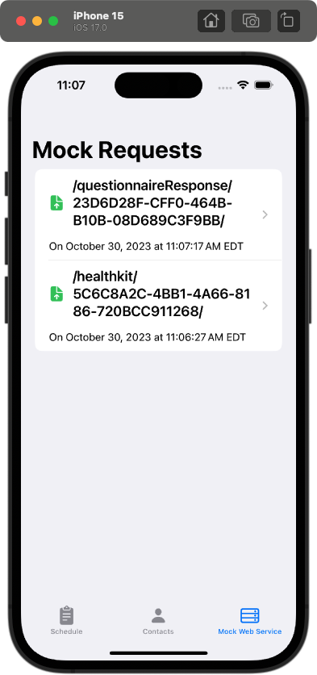

<!--

This source file is part of the Stanford Spezi Template Application project

SPDX-FileCopyrightText: 2023 Stanford University

SPDX-License-Identifier: MIT

-->

# Spezi Template Application

[](https://github.com/StanfordSpezi/SpeziTemplateApplication/actions/workflows/beta-deployment.yml)
[](https://codecov.io/gh/StanfordSpezi/SpeziTemplateApplication)
[](https://zenodo.org/badge/latestdoi/589846478)

This repository contains the Spezi Template Application.
It demonstrates using the [Spezi](https://github.com/StanfordSpezi/Spezi) framework template and builds on top of the [Stanford Biodesign Digital Health Template Application](https://github.com/StanfordBDHG/TemplateApplication).


## Application Structure

The Spezi Template Application uses a modularized structure using the [Spezi modules](https://swiftpackageindex.com/StanfordSpezi) enabled by the Swift Package Manager.

The application uses the Spezi [`FHIR` standard](https://github.com/StanfordSpezi/SpeziFHIR) to provide a shared repository for data exchanged between different modules using the `FHIR` standard.
You can learn more about the Spezi standards-based software architecture in the [Spezi documentation](https://github.com/StanfordSpezi/Spezi).


## Build and Run the Application

You can build and run the application using [Xcode](https://developer.apple.com/xcode/) by opening up the **TemplateApplication.xcodeproj**.

The application provides a [Firebase Firestore](https://firebase.google.com/docs/firestore)-based data upload and [Firebase Authentication](https://firebase.google.com/docs/auth) login & sign-up.
It is required to have the [Firebase Emulator Suite](https://firebase.google.com/docs/emulator-suite) to be up and running to use these features to build and test the application locally. Please follow the [installation instructions](https://firebase.google.com/docs/emulator-suite/install_and_configure). 

You do not have to make any modifications to the Firebase configuration, login into the `firebase` CLI using your Google account, or create a project in firebase to run, build, and test the application!

Startup the [Firebase Emulator Suite](https://firebase.google.com/docs/emulator-suite) using
```
$ firebase emulators:start
```

After the emulators have started up, you can run the application in your simulator to build, test, and run the application.

The application includes the following feature flags that can be configured in the [scheme editor in Xcode](https://help.apple.com/xcode/mac/11.4/index.html?localePath=en.lproj#/dev0bee46f46) and selecting the **TemplateApplication** scheme, the **Run** configuration, and to switch to the **Arguments** tab to add, enable, disable, or remove the following arguments passed on launch:
- ``--skipOnboarding``: Skips the onboarding flow to enable easier development of features in the application and to allow UI tests to skip the onboarding flow.
- ``--showOnboarding``: Always show the onboarding when the application is launched. Makes it easy to modify and test the onboarding flow without the need to manually remove the application or reset the simulator.
- ``--disableFirebase``: Disables the Firebase interactions, including the login/sign-up step and the Firebase Firestore upload.
- ``--useFirebaseEmulator``: Defines if the application should connect to the local firebase emulator. Always set to true when using the iOS simulator.


### Template Onboarding Flow

The onboarding contains the different steps.
It uses the Spezi `Onboarding` module to display different onboarding-related views like the information about the application, a consent screen, and a screen to display a HealthKit consent view.

<p float="left">
 
 
 
 
</p>


### Template Schedule

The scheduler part of the application provides the functionality to schedule a recurring task and bind it to an action, e.g., displaying a questionnaire.
It uses the Spezi `Scheduler` and `Questionnaires` modules to schedule the tasks as defined in the `TemplateApplicationScheduler`.

<p float="left">
 
 
 
</p>


### Template Contacts

The contacts part of the application provides the functionality to display contact information in your application.
It uses the Spezi `Contacts` module to use the contact-related views provided by Spezi.

<p float="left">
 
</p>


### Template Mock Data Storage Provider

The mock upload view allows a developer to get an overview of the synconization of data between the local `FHIR` model and a cloud storage provider.
It uses the Spezi [`FHIRMockDataStorageProvider`](https://github.com/StanfordSpezi/SpeziFHIR) to get information that is stored in the `FHIR` standard in the Spezi Template Application.

<p float="left">
 
 
</p>


## Continous Delivery Workflows

The Spezi Template application includes continuous integration (CI) and continuous delivery (CD) setup.
- Automatically build and test the application on every pull request before deploying it.
- An automated setup to deploy the application to TestFlight every time there is a new commit on the repository's main branch.
- Ensure a coherent code style by checking the conformance to the SwiftLint rules defined in `.swiftlint.yml` on every pull request and commit.
- Ensure conformance to the [REUSE Spacification]() to property license the application and all related code.

Please refer to the [Stanford Biodesign Digital Health Template Application](https://github.com/StanfordBDHG/TemplateApplication) and the [ContinousDelivery Example by Paul Schmiedmayer](https://github.com/PSchmiedmayer/ContinousDelivery) for more background about the CI and CD setup for the Spezi Template Application.


## Contributors & License

This project is based on [ContinousDelivery Example by Paul Schmiedmayer](https://github.com/PSchmiedmayer/ContinousDelivery), and the [StanfordSpezi Template Application](https://github.com/StanfordSpezi/TemplateApplication) provided using the MIT license.
You can find a list of contributors in the `CONTRIBUTORS.md` file.

The Spezi Template Application and the Spezi framework are licensed under the MIT license.
