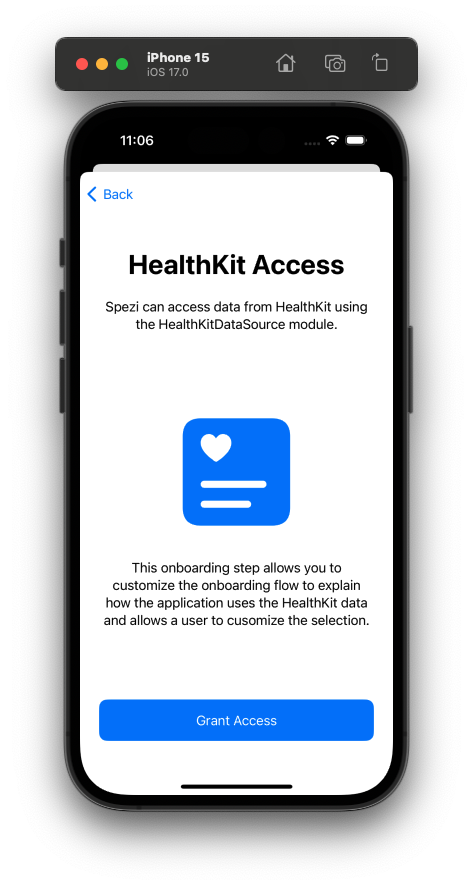
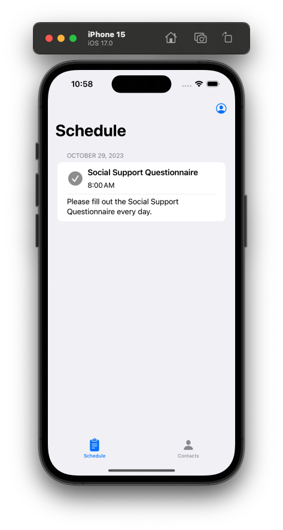

<!--

This source file is part of the Stanford Spezi Template Application project

SPDX-FileCopyrightText: 2023 Stanford University

SPDX-License-Identifier: MIT

-->

# Spezi Template Application

[](https://github.com/StanfordSpezi/SpeziTemplateApplication/actions/workflows/beta-deployment.yml)
[](https://codecov.io/gh/StanfordSpezi/SpeziTemplateApplication)
[](https://zenodo.org/badge/latestdoi/589846478)

This repository contains the Spezi Template Application.
It demonstrates using the [Spezi](https://github.com/StanfordSpezi/Spezi) framework template and builds on top of the [Stanford Biodesign Digital Health Template Application](https://github.com/StanfordBDHG/TemplateApplication).

> [!NOTE] 
> Do you want to try out the Spezi Template Application? You can download it to your iOS device using [TestFlight](https://testflight.apple.com/join/ipEezBY1)!


## Application Structure

The Spezi Template Application uses a modularized structure using the [Spezi modules](https://swiftpackageindex.com/StanfordSpezi) enabled by the Swift Package Manager.

The application uses [HL7 FHIR](https://www.hl7.org/fhir/) and the Spezi [`FHIR` module](https://github.com/StanfordSpezi/SpeziFHIR) to provide a common standard to encode data gathered by the application as defined in the Spezi [`Standard`](https://swiftpackageindex.com/stanfordspezi/spezi/documentation/spezi/standard) found in the application.
You can learn more about the Spezi standards-based software architecture in the [Spezi documentation](https://swiftpackageindex.com/stanfordspezi/spezi/documentation/spezi).


## Build and Run the Application

You can build and run the application using [Xcode](https://developer.apple.com/xcode/) by opening up the **TemplateApplication.xcodeproj**.


### Get Started without Firebase

You can start using the application without any additional installations if you use the ``--disableFirebase`` feature flag, enabled by default when opening the Xcode project. The login and account setup is skipped in this configuration.


### Firebase Setup

The application also provides a [Firebase Firestore](https://firebase.google.com/docs/firestore)-based data upload and [Firebase Authentication](https://firebase.google.com/docs/auth) login & sign-up.
It is required to have the [Firebase Emulator Suite](https://firebase.google.com/docs/emulator-suite) to be up and running to use these features to build and test the application locally. Please follow the [installation instructions](https://firebase.google.com/docs/emulator-suite/install_and_configure). 

> [!NOTE] 
> You do not have to make any modifications to the Firebase configuration, login into the `firebase` CLI using your Google account, or create a project in Firebase to run, build, and test the application!

Startup the [Firebase Emulator Suite](https://firebase.google.com/docs/emulator-suite) using
```
$ firebase emulators:start
```

After the emulators have started up, you can run the application in your simulator to build, test, and run the application and see the results show up in Firebase.

If you want to connect your project to a development or production Firebase cloud project, you can provide your [`GoogleService-Info.plist`](https://firebase.google.com/docs/ios/setup) in a base 64 representation in the [GitHub secrets](https://docs.github.com/en/actions/security-guides/security-hardening-for-github-actions) (`GOOGLE_SERVICE_INFO_PLIST_BASE64`) of your project where it is picked up and loaded in the configured path setup in the [`beta-deployment.yml`](.github/workflows/beta-deployment.yml) [GitHub Action](https://docs.github.com/en/actions) using the `googleserviceinfoplistpath` parameter that needs to be adapted to your project structure.

You can generate a base 64 representation of a file after you [navigated into the folder](https://en.wikipedia.org/wiki/Cd_(command)#Usage) where you have downloaded your [`GoogleService-Info.plist`](https://firebase.google.com/docs/ios/setup) file to.
```shell
base64 -i GoogleService-Info.plist
```

> [!WARNING]  
> We do **not recommend** to commit your Firebase secrets and configuration file to your project. While it can extract the file from the deployed application, we encourage open-source projects to make it clear to contributors to set up their own Firebase project.

The deployment requires you to store your Google service account JSON credentials in a base 64 representation in the `GOOGLE_APPLICATION_CREDENTIALS_BASE64`. You can learn more about how to generate the JSON in the [Firebase documentation](https://firebase.google.com/docs/app-distribution/authenticate-service-account). The service account must have the minimally required permissions (not the `Firebase App Distribution Admin` role) as documented at https://firebase.google.com/docs/projects/iam/roles-predefined for your deployment needs and setup.

Be sure to update your `.firebaserc` project name and placeholder `GoogleService-Info.plist` project identifier to always reflect the name of your project and all security rules to reflect any changes in your application.


### Other Configuration Options

The application also includes the following feature flags that can be configured in the [scheme editor in Xcode](https://help.apple.com/xcode/mac/11.4/index.html?localePath=en.lproj#/dev0bee46f46) and selecting the **TemplateApplication** scheme, the **Run** configuration, and to switch to the **Arguments** tab to add, enable, disable, or remove the following arguments passed on launch:
- ``--skipOnboarding``: Skips the onboarding flow to enable easier development of features in the application and to allow UI tests to skip the onboarding flow.
- ``--showOnboarding``: Always show the onboarding when the application is launched. Makes it easy to modify and test the onboarding flow without the need to manually remove the application or reset the simulator.
- ``--disableFirebase``: Disables the Firebase interactions, including the login/sign-up step and the Firebase Firestore upload.
- ``--useFirebaseEmulator``: Defines if the application should connect to the local Firebase emulator. Always set to true when using the iOS simulator.


## Template Onboarding Flow

The onboarding contains different steps.
It uses the [**Spezi Onboarding** module](https://github.com/StanfordSpezi/SpeziOnboarding) to display different onboarding-related views like the information about the application, a consent screen, and a screen to display a HealthKit consent view.

<p float="left">
 
 
 
 
</p>


## Template Schedule

The scheduler part of the application provides the functionality to schedule a recurring task and bind it to an action, e.g., displaying a questionnaire.
It uses the [**Spezi Scheduler**](https://github.com/StanfordSpezi/SpeziScheduler) and [**Spezi Questionnaire**](https://github.com/StanfordSpezi/SpeziQuestionnaire) modules to schedule the tasks as defined in the `TemplateApplicationScheduler`.

<p float="left">
 
 
 
</p>


## Template Contacts

The Contacts part of the application provides the functionality to display contact information in your application.
It uses the [**Spezi Contacts** module](https://github.com/StanfordSpezi/SpeziContact) to use the contact-related views provided by Spezi.

<p float="left">
 
</p>


## Template Mock Data Storage Provider

The mock upload view allows a developer to get an overview of the data synchronization between the application and a cloud storage provider.
It is shown in the application when the ``--disableFirebase`` configuration flag is active.
It uses the [**Spezi Mock Web Service** module](https://github.com/StanfordSpezi/SpeziMockWebService) to enable this functionality.

<p float="left">
 
 
</p>


## Continuous Delivery Workflows

The Spezi Template application includes continuous integration (CI) and continuous delivery (CD) setup.
- Automatically build and test the application on every pull request before deploying it. If your organization doesn't have a self-hosted macOS runner modeled after the setup in the [StanfordBDHG ContinuousIntegration](https://github.com/StanfordBDHG/ContinousIntegration) setup, you will need to remove the `runsonlabels` arguments in the `build-and-test.yml` file to ensure that the build runs on the default macOS runners provided by GitHub.
- An automated setup to deploy the application to TestFlight every time there is a new commit on the repository's main branch.
- Ensure a coherent code style by checking the conformance to the SwiftLint rules defined in `.swiftlint.yml` on every pull request and commit.
- Ensure conformance to the [REUSE Specification]() to property license the application and all related code.

Please refer to the [Stanford Biodesign Digital Health Template Application](https://github.com/StanfordBDHG/TemplateApplication) and the [ContinuousDelivery Example by Paul Schmiedmayer](https://github.com/PSchmiedmayer/ContinousDelivery) for more background about the CI and CD setup for the Spezi Template Application.


## Contributing

Contributions to this project are welcome. Please make sure to read the [contribution guidelines](https://github.com/StanfordSpezi/.github/blob/main/CONTRIBUTING.md) and the [contributor covenant code of conduct](https://github.com/StanfordSpezi/.github/blob/main/CODE_OF_CONDUCT.md) first.

This project is based on [ContinuousDelivery Example by Paul Schmiedmayer](https://github.com/PSchmiedmayer/ContinousDelivery) and the [Stanford Biodesign Digital Health Template Application](https://github.com/StanfordBDHG/TemplateApplication) provided using the MIT license.


## License

This project is licensed under the MIT License. See [Licenses](LICENSES) for more information.


